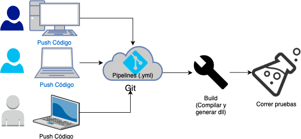
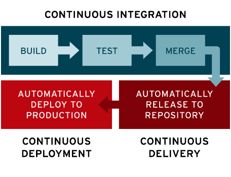
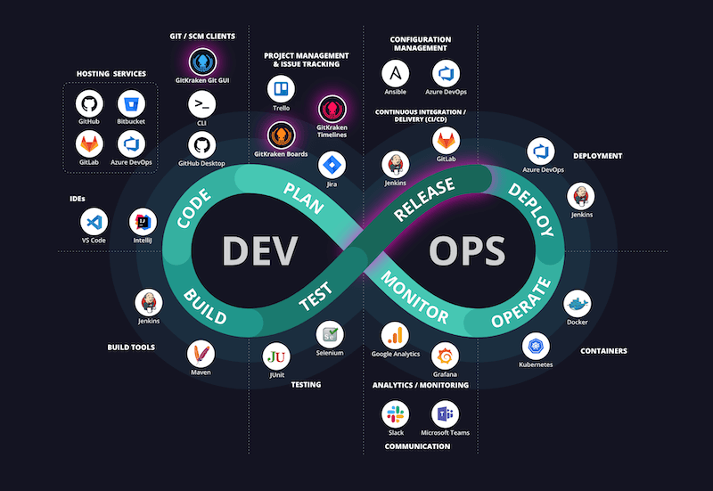

# CI/CD/CD

# Continuous Integration

1. Es una de las principales practicas DevOps y consiste en automatizar la gestion de los cambios de codigo de multiples ontribuidores en un unico proyecto de software.

2. Permite a los desarrolladores realizar merge grecuentemente en un repositorio central, luego permite que la compilacion y pruebas automaticas sean ejecutadas.

3. El sistema de control de versiones es el nucleo de todo el proceso de integracion continua y se puede complementar con pruebas de codigo automatico, revision se sintaxis, etc.

# Continuous Delivery

1. Es una extension del proceso de integracion continua, dado que despliega todos los cambios de manera automatica en el entorno de prueba y/o produccion.

2. Se cienta con un proceso de despligue automatizado que se ejecuta despues de la fase de construccion o de forma manual con frecuenta predeterminada.

3. El Despliegue Continuo (CD) automatiza el despliegue de aplicaciones a diferentes entornos de infraestructura.

# Continuous Deployment

1. Va un paso mas alla de la entrega continua en el nivel de automatizacion.

2. Cuando la aplicacion pasa todas las fases anteriores el software es desplegado en produccion y entregado al cliente final, no hay intervenciones humanas, solo si las pruebas fallan se detiene el proceso.

# Conceptos y herramientas del proceso

* **Pipeline**: Grupo logico de actividades que de manera conjunta realizan una tarea.
* **Jenkins**: Servidor de automatizacion opensource, para el proceso de CI.
* **Slack**: Plataforma propietaria de comunicacion empresarial. Es una plataforma de comunicacion para desarrolladores donde se pueden recibir notifiaciones y alertas de los procesos de integracion y entrega continua.
* **SonarQube**: Plataforma OpenSource para la inspeccion continua de la calidad del codigo, puede ejecutar revisiones en automatico.
* **Selenium**: FrameWork para probar aplicaciones web, permite escribir test funcionales de manera sencilla.

## Herramientas para las fases de CI/CD DevOps:

