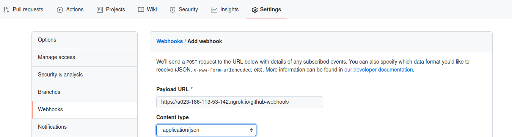
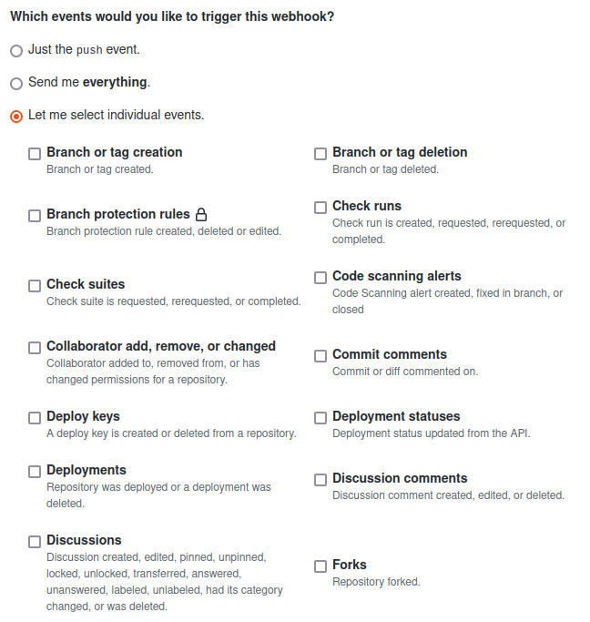
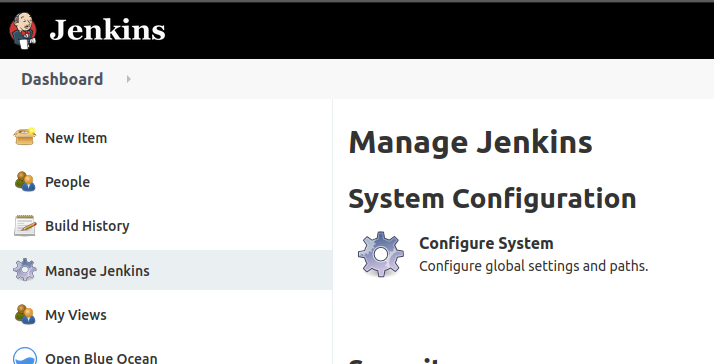
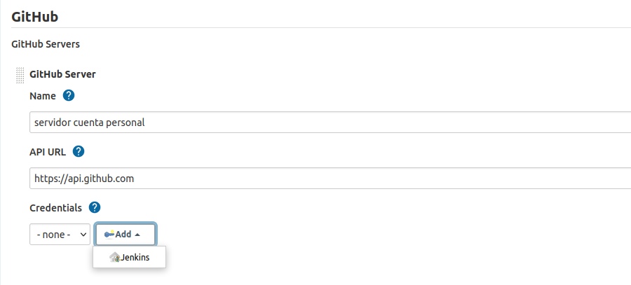

# Documentacion para crear Jobs, Pipelines en Jenkins

## Pasos

1. Create a job
2. Opciones: Crear un proyecto de estilo libre o Pipelines
3. Configurar el origen del codigo fuente: Seleccionar Git e ingresar la URL del repositorio objetivo.
4. Configuracion del pom.xml

# Jenkins con Github
## WebHooks

Permite tener comunicacion basada en eventos, desde el repositorio de codigo a otros programas interesados, Ej: Jenkins.
Para hacer uso de webhooks nuestro servidor de integracion continua tiene que ser visible desde internet.

La ruta es la siguiente para la configuracion en GitHub:

1. Dentro del repositorio ir a la opcion de configuracion o settings.
2. Dirigirse a la opcion webhooks.
3. En el campo Payload URL, poner la direccion del servidor de integracion continua Jenkins.
4. En el campo Content Type escoger la opcion: application/json.

5. Escoger por cuales eventos se desea recibir notificaciones a jenkins (Solo por eventos push, cualquier evento o de manera personalizada).

# Crear un Pipeline en Jenkins

Previamente se debe tener lista la configuracion de webhooks. Para hacer la configuracion debemos seguir los pasos mencionados desde el servidor jenkins.

1. Entrar en la opcion *Administrar Jenkins* o *Manage Jenkins*.
2. Entrar en la opcion *Configuracion de sistema* o *Configure System*

3. Buscar la opcion de GitHub, y añanar un GitHub Server, poner un nombre y acceder las redenciales.

## Crear Pipeline basado en eventos webhook

1. Presionar New Item o nueva tarea
2. Crear un proyecto de estilo libre
3. Seleccionar Github Project
4. Tomar URL del repositorio
5. Configurar el Origen del codigo. Selecionar git.
6. Agregar url del repositorio y poner las credenciales del repositorio.

7. Para que el evento sea lanzado en automatico por los webhooks configurados

